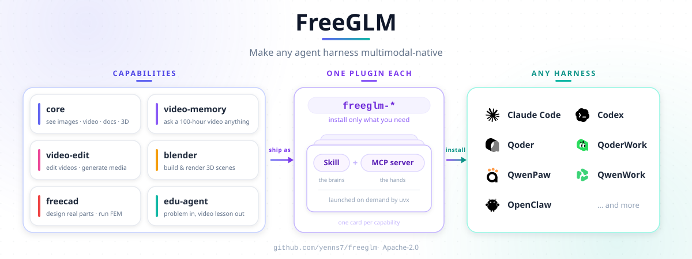

# FreeGLM

[English](README.md) · **中文**

*「眼贴膜」—— 让 Agent 重新看清世界。* 😌

面向视觉语言模型的原生多模态插件 —— 衍生自 [Qwen-MM-Plugins](https://github.com/QwenLM/Qwen-MM-Plugins)（Apache-2.0），在原有 DashScope Qwen 后端之上，新增了**智谱 GLM-4.6V-Flash** 视觉后端。让任何 Agent Harness 都具备原生多模态能力，并自动帮你选到最快的便宜后端。

## 目录

- [🧩 能力](#-能力)
- [🏗 架构](#-架构)
- [📦 安装](#-安装)
- [🔧 依赖](#-依赖)
- [🔑 配置](#-配置)
- [🚀 快速开始](#-快速开始)
- [🤖 给 Agent 的快速接入提示词](#-给-agent-的快速接入提示词)
- [🧪 开发](#-开发)
- [📄 License 与署名](#-license-与署名)

## 🧩 能力

每个能力单独安装 —— 一个 **skill**（让模型知道有这套工具）+ 一个可选的 **MCP server**（工具本体）。

我们提供了一组 [**cookbooks**](cookbooks/),展示这些插件的实战效果 —— 每个能力的 cookbook(见下表各行)含完整工具清单、安装与实测案例。

| 能力 | 做什么 | 安装名 | Cookbook |
|---|---|---|---|
| **core** | 本地 I/O 插件：动态分辨率读取图片与视频，可视化任意文件(如文档、3D 等)——外加一些图像工具(裁剪 / 标注 / 抽帧) | `freeglm-core` | [link](cookbooks/core/usage.md) |
| **api** | 云端 API 理解媒体，按模型族划分。**VL**（视觉对话、OCR、grounding）跑在**双后端**上：DashScope Qwen（默认，`qwen3.7-plus`）或**智谱 GLM（`glm-4.6v-flash`）** —— 只设 `ZHIPU_API_KEY` 时自动选中，或每次调用用 `provider="zhipu"` 指定。另有 DashScope 上的 Omni 音视频（带时间戳 / 说话人标签的 ASR、多说话人分离、分段描述、时序定位、事件计数）、ASR 与分割（SAM3） | `freeglm-api` | [link](cookbooks/api/usage.md) |
| **search** | 联网 + 反查图搜索用于事实核验:网页搜索、网页抽取、反查图;目前支持 Serper | `freeglm-search` | [link](cookbooks/search/usage.md) |
| **video-memory** | 长视频记忆：层次化图记忆，支撑超长视频问答 | `freeglm-video-memory` | [link](cookbooks/video-memory/usage.md) |
| **video-edit** | 视频剪辑 + 生成：剪辑工作流 + 图片 / 视频 / 音频生成 | `freeglm-video-edit` | — |
| **blender** | Blender 三维建模：对一个**正在运行**的 Blender 写 Python（瘦客户端，22 工具）—— 建模 / 材质 / 灯光 / 渲染 | `freeglm-blender` | [link](cookbooks/blender/usage.md) |
| **freecad** | FreeCAD 参数化 CAD：驱动一个**正在运行**的 FreeCAD（瘦客户端，14 工具）—— 建模、改属性、STEP/STL 导入导出、FEM 分析 | `freeglm-freecad` | [link](cookbooks/freecad/usage.md) |
| **edu-agent** | 讲题视频：把一道数学 / 理科题或题目图片变成一步步讲解的中文视频 / 交互页面（**纯 skill**，无 MCP server） | `freeglm-edu-agent` | — |

## 🏗 架构



## 📦 安装

一个能力 = 一个 **skill**（让模型知道有这套工具）+ 一个可选的 **MCP server**（工具本体，`uvx` 按需拉起 —— 依赖 [uv](https://docs.astral.sh/uv/)，不用手动 pip）。

### 推荐：引导式安装器

一个脚本搞定 **install · configure · verify · uninstall**，覆盖它支持的所有 harness（Claude Code · Codex · Qoder · OpenClaw · Qwen Code · Gemini CLI）。它底层调各 harness 自己的原生安装 —— 不重造轮子 —— 并把配置写进统一的 `~/.freeglm/config`（GUI / 终端都读），一次配好：

```bash
curl -fsSL https://raw.githubusercontent.com/yenns7/freeglm/main/install.sh | bash   # 引导菜单
```

**ZCode** 不在 `PATH` 上提供 CLI，所以是一步手动操作：把本仓库加为插件市场，再在 ZCode 界面里按能力安装（`marketplace add https://github.com/yenns7/freeglm.git` → `install freeglm-core@freeglm`）。仓库自带 zcode 就绪清单（`.zcode-plugin/`）；完整指南见 [docs/zh/adapting_zcode.md](docs/zh/adapting_zcode.md)。

也可以只跑单个动作 —— `bash install.sh install` / `configure` / `verify` / `uninstall`（`configure` 和 `verify` 各自做什么，见下面的[配置](#-配置)与[依赖](#-依赖)）。

**Windows x64：**推荐使用 WSL2（建议 Ubuntu），在 WSL home 目录中 clone 仓库
（例如 `~/code`），不要放在 `/mnt/c` 这类 Windows 挂载盘下，然后运行相同命令。
当前 Windows 仅支持 WSL2；原生 Windows 尚未完成验证。简要说明见
[Windows 安装说明](docs/zh/installation.md#windows-wsl2)。

### 手动（逐 harness）

想用 harness 自己的命令，或你在 opencode / pi / QwenPaw 上（安装器不覆盖这几个）？那就自己注册 skill + MCP。

**有插件市场的 harness**（Claude Code · Qoder · Codex · OpenClaw · Qwen Code）—— 加市场，再装某个能力（把 `<cap>` 换成 `core` / `api` / `search` / `video-memory` / `video-edit` / `blender` / `freecad`）。默认先装 `core`（本地 I/O 基座,其他能力都建立在它之上）,再按需装其他:

```bash
# Claude Code
claude   plugin  marketplace add https://github.com/yenns7/freeglm.git
claude   plugin  install       freeglm-<cap>@freeglm
# Qoder
qodercli plugins marketplace add https://github.com/yenns7/freeglm.git
qodercli plugins install       freeglm-<cap>@freeglm
# Codex
codex    plugin  marketplace add https://github.com/yenns7/freeglm.git
codex    plugin  add           freeglm-<cap>@freeglm
# OpenClaw
openclaw plugins install       freeglm-<cap> --marketplace https://github.com/yenns7/freeglm.git
# Qwen Code
qwen extensions install https://github.com/yenns7/freeglm.git:freeglm-<cap> --consent
```

`marketplace add` 也接受本地仓库路径；重复执行是安全的。在 **codex** 上，`marketplace add` **不会**刷新已添加的 marketplace，所以要装入新增能力时，先执行 `codex plugin marketplace upgrade freeglm` 再 `plugin add`。

**其它 harness**（Gemini CLI · opencode · pi · QwenPaw · **ZCode** · …）在各自配置里注册 skill + MCP —— 各 harness 的精确配置块见 [`docs/zh/installation.md`](docs/zh/installation.md) 与 [ZCode 适配指南](docs/zh/adapting_zcode.md)。最省事：**直接让 agent 帮你装** —— 「装一下 `freeglm-<cap>`」。

## 🔧 依赖

`uvx` 首次启动时按 profile 把 Python 依赖装进隔离缓存 —— 不用手动 pip。需要你自己装的只有**系统工具**：`ffmpeg`（视频 / 音频），外加 `visualize` 可选的 `libreoffice` / `blender` / `texlive` / `chromium`。跑 `bash install.sh verify` 自检已装的能力 —— 它会确认 API key、并报告缺哪些系统工具（内部对每个能力预拉起 uvx 环境并跑 `--check-system`）。完整系统工具表、edu-agent（纯 skill）的准备、以及 blender/freecad 瘦客户端说明，见 [`docs/zh/installation.md`](docs/zh/installation.md)。

## 🔑 配置

API 类工具需要 key —— 原生读图 / 视频 / 文档不需要：

- `ZHIPU_API_KEY` —— **GLM-4.6V-Flash** 视觉后端，供 `vision_chat` / `ocr` / `grounding` 使用。只设这一个 key，VL 工具就会自动路由到智谱（无需 DashScope）。可选：`ZHIPU_BASE_URL`、`ZHIPU_VISION_MODEL`
- `DASHSCOPE_API_KEY` —— `vision_chat` / `ocr` / `grounding`（Qwen 后端）/ `transcribe_audio` / Omni 音视频理解 / 生成类 / video-memory 构建
- `SERPER_API_KEY` —— `web_search` / `web_extractor` / `image_search`

在 shell 里 export，或写进 `~/.freeglm/config`（仅当变量未在环境中时才读取 —— 这样 GUI 启动的 harness 也能拿到）。引导式安装器的 Configure 步骤会帮你写这个文件：

```bash
bash install.sh configure     # 交互式：API key、端点、目录、OSS、主机地址 —— 整份分组配置
```

非交互 / 自动化配置与完整环境变量表见 [`docs/zh/installation.md`](docs/zh/installation.md)。

## 🚀 快速开始

装好某个能力后，在 harness 里引用文件直接提问，模型会自动调用对应工具。读取是**动态分辨率**的：每张图片、每帧视频、每页文档都会自动缩放到 VL 模型的 patch grid —— 一张 4K 截图上的细小文字和一张小缩略图都能以各自需要的清晰度读进来，无需手动缩放。

```text
# core —— 读图片 / 视频 / 文档 / 3D 模型（本地、动态分辨率）
@dashboard-4k.png      读出这张仪表盘里的每一个数字。
@report.pdf            总结第 3 页。

# api —— 云端 VL + Omni API。VL 工具在只设 ZHIPU_API_KEY 时自动走 GLM-4.6V-Flash，
#        否则走 DashScope Qwen；Omni / ASR / 分割始终用 DashScope。
@receipt.jpg           OCR 这张小票并把各行金额加总。                        # VL（GLM 或 Qwen）
@street.jpg            把画面里每一辆车都框出来。                            # grounding
@meeting.mp4           带说话人标签和时间戳转写这段会议。                    # omni
@sports-clip.mp4       统计每次成功传球，并列出发生时间。                    # omni
@song.mp3              标注曲风、情绪、乐器、调性和人声特征。                # omni

# search —— 联网 + 反查图，核实画面里的东西
@place.jpg             这张照片是在哪拍的？                     # image_search + web_search

# video-memory —— 对长视频提问；首次提问自动构建 memory
@lecture-2h.mp4        这段视频的主要观点是什么？带上时间戳。

# video-edit —— 图片 / 视频 / 音频生成 + 剪辑工作流
                       生成一张 1024×1024 的图：小熊猫在深夜敲代码。
@/path/to/media        帮我把这个视频剪到大约 3 分钟。

# blender —— 驱动正在运行的 Blender 建模 / 材质 / 灯光 / 渲染（瘦客户端，22 工具）
                       建一个低多边形木凳，加一盏暖色主光，然后渲染出来。

# freecad —— 在正在运行的 FreeCAD 里做参数化 CAD（瘦客户端，14 工具；STEP/STL、FEM）
                       建一颗 M6 六角螺栓、长 30 mm，导出成 STEP。

# edu-agent —— 把一道数学 / 理科题变成一步步讲解的中文视频（纯 skill）
@geometry-problem.png  把这道题的解法讲清楚，做成带旁白的视频。
```

每个能力的全部工具、安装与实测案例见其 🍳 [cookbook](cookbooks/)。

## 🤖 给 Agent 的快速接入提示词

FreeGLM 就是给 Agent 用的，最快的接入方式是把下面这段直接粘给 agent（Claude Code / Codex / Qoder —— 任何已装好 `freeglm-<cap>` 的 harness）。它告诉模型两个 VL 后端怎么选，以及一个关键规则：**读图必须走 MCP 工具**，而不是用 harness 自带的内置 OCR / 视觉能力 —— 这样你才能用上配置好的模型（比如免费的 GLM-4.6V-Flash），而不是落到本机 macOS OCR 上：

```text
你有 FreeGLM 的 MCP 工具可用。规则如下：

1. 媒体一律走工具。要读、要 OCR、要描述、要框选任何图片 / 视频，必须调用
   `freeglm-*` 的 MCP 工具（vision_chat / ocr / grounding）。绝不要退回用
   harness 自带的内置图像 / OCR 能力来做这些事。

2. VL 后端（vision_chat / ocr / grounding）有两个 provider，自动选择：
   - 智谱 GLM-4.6V-Flash：只设了 ZHIPU_API_KEY 时默认选中（无需任何 DashScope 配置）。
     速度快、有免费额度、不输出思考 token。模型 `glm-4.6v-flash`，端点 open.bigmodel.cn。
   - DashScope Qwen：其余情况默认（DASHSCOPE_API_KEY）。模型 `qwen3.7-plus`。
   - 想强制指定某后端，调用时传 provider="zhipu" 或 provider="dashscope"。
   - 智谱没有视频模态：视频会在本地被采样成一帧帧图片 —— 这很正常，
     video_max_frames 别给太大（约 1fps，帧数 ≈ 视频秒数）。

3. 其它能力（Omni 音视频、ASR、分割、生成、搜索）分别需要 DASHSCOPE_API_KEY /
   SERPER_API_KEY —— GLM 不覆盖这些。

4. 每个工作流先用一次 dry_run=true 预览请求 payload，再真正调用。
```

## 🧪 开发

开发环境、贡献规范和检查命令见 [`CONTRIBUTING.md`](CONTRIBUTING.md)。详细指南：
[本地调试](docs/zh/local_development.md) · [添加能力](docs/zh/how_to_add_new_capability.md) ·
[测试](docs/zh/testing.md)。

## 📄 License 与署名

Apache-2.0 —— 见 [`LICENSE`](LICENSE) 与 [NOTICE](NOTICE)。

本项目是 [Qwen-MM-Plugins](https://github.com/QwenLM/Qwen-MM-Plugins)（Qwen 团队，Apache-2.0）的**衍生作品** —— 一个改名后的 fork，并在上游 VL 工具之上新增了**智谱 GLM-4.6V-Flash** 视觉后端（provider 路由、视频转帧降级、`enable_thinking` 隔离、配置 / 校验接线）。上游变更可通过 GitHub 的 fork 关系追踪。

Blender 和 FreeCAD 能力内置(vendor)了第三方 MIT 许可的代码,署名见 [`src/capabilities/blender/NOTICE.md`](src/capabilities/blender/NOTICE.md) 和 [`src/capabilities/freecad/NOTICE.md`](src/capabilities/freecad/NOTICE.md)。
