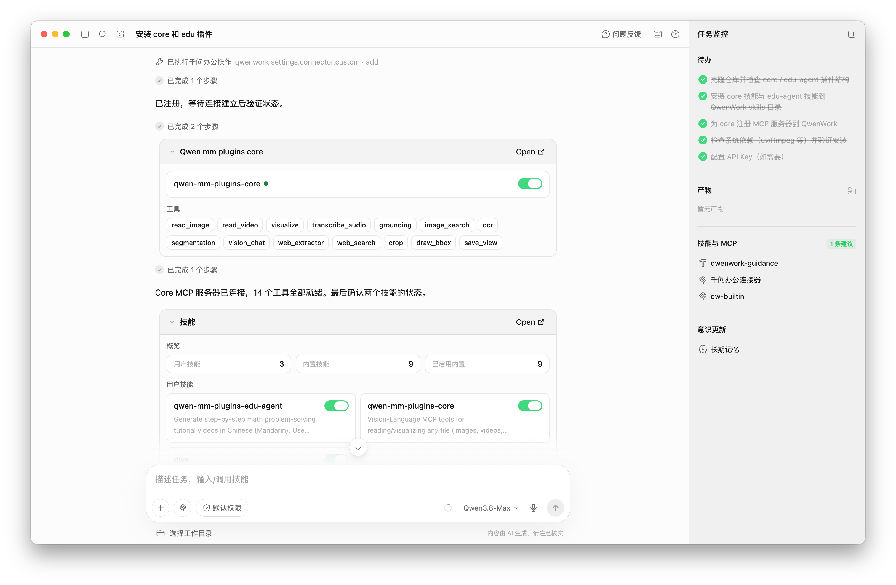

# Cookbook — FreeGLM Core (+ api / search)

`freeglm-core` is the local file capability: read and visualize any file at model-optimized
resolution, plus image tools (crop, annotate, extract frames). The cloud model/API tools that
used to live here now ship as two sibling capabilities — `freeglm-api` (caption/OCR/grounding/
segmentation/ASR) and `freeglm-search` (web + reverse-image search). This cookbook covers the
family; the tool list below marks which plugin each tool belongs to. See the [Cases](#cases) below
for worked examples.

---

## Tools

**`freeglm-core` — local reading (content fed directly to the model)**
- `read_image` — dynamic-resolution image reading
- `read_video` — extracts video frames with automatic FPS / resolution
- `media_info` — full media metadata via ffprobe (run before any clip/edit)
- `visualize` — general-purpose file visualization: PDF / Office / CSV / code / SVG / DrawIO / 3D / GIS / Notebook / LaTeX

**`freeglm-core` — image / frame output (saved to file + preview)**
- `crop` — crop an image by box (normed to 0-1000)
- `draw_bbox` — draw annotation boxes on an image (pairs with `grounding`)
- `save_view` — extract document pages / video frames into standalone image files

**`freeglm-api` — cloud understanding (DashScope + SAM3)**
- `vision_chat` — call a vlm (default: qwen3.7-plus) for vision chat, supporting image / video input
- `ocr` — text recognition in images
- `grounding` — object detection/localization, returning pixel bboxes (pairs with `draw_bbox`)
- `segmentation` — text-prompted segmentation (self-hosted SAM3)
- `transcribe_audio` — speech recognition (default: qwen3-asr), output as SRT / text / JSON

**`freeglm-search` — web + reverse-image search (Serper)**
- `web_search` — web search, returning titles / snippets / URLs
- `web_extractor` — fetch a web page's main text, optionally summarized
- `image_search` — search by image (reverse image search)

> For exact schemas, see each capability's `SKILL.md` or each tool's inputSchema.

---

## Install

```bash
claude plugin marketplace add https://github.com/yenns7/freeglm.git
claude plugin install freeglm-core@freeglm      # local reading
claude plugin install freeglm-api@freeglm       # cloud understanding (optional)
claude plugin install freeglm-search@freeglm    # web/image search (optional)
```

## Environment variables

| Variable | Description |
|----------|-------------|
| `DASHSCOPE_API_KEY` | `freeglm-api` — the DashScope-backed tools (`vision_chat`, `ocr`, `grounding`, `transcribe_audio`). `core`'s local reading needs no key. |
| `DASHSCOPE_BASE_URL` | Optional — override the DashScope OpenAI-compatible base URL (proxies/gateways). |
| `SERPER_API_KEY` | `freeglm-search` — the web/image tools (`web_search` / `web_extractor` / `image_search`). Sign up at [serper.dev](https://serper.dev) — a Google-search API with a free starter tier |
| `SAM3_SERVER_URL` | `freeglm-api` — only for `segmentation`. SAM3 is **self-hosted**: stand up the GPU HTTP server with the skill's [`references/launch_sam3_server.py`](../../src/capabilities/api/skill/references/launch_sam3_server.py) (needs the `sam3` package, a CUDA-enabled PyTorch, and the SAM3 checkpoint), then point this at it, e.g. `http://localhost:8787`. |

> Set these via env vars, `~/.freeglm/config`, or the guided installer **`bash install.sh`** (`bash install.sh verify` checks what's set). Precedence: env var > config file > default.

---

## Cases

### Case 1 — read a video, then read Figure 2 from a PDF (Claude Code)

Reads a full promo video, then opens a 35-page PDF and pulls out a specific figure.

▶ **[View the detailed trace in Claude Code](https://qianwen-res.oss-accelerate.aliyuncs.com/FreeGLM/asserts/core/case-core-cc-basic-use.html)**

<p align="center">
  
</p>

### Case 2 — locate the cakes, then identify a place through the DashScope service (Codex)

`@cakes.png` → detect every cake and draw numbered boxes; `@place.png` → identify the location, cross-checked with a web search.

▶ **[View the detailed trace in Codex](https://qianwen-res.oss-accelerate.aliyuncs.com/FreeGLM/asserts/core/case-core-codex-api-use.html)**


<p align="center">
  
</p>

### Case 3 — install the plugins in GUI harness e.g. QwenWork, QoderWork

Just **Query** the agent to set up: `hello 帮我装一下 https://github.com/yenns7/freeglm 的 core 和 edu 插件`

The agent installs the `core` + `edu-agent` skills and the core MCP server:

<p align="center">
  
</p>
